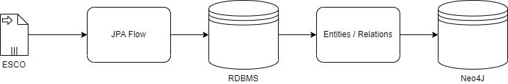

# Getting Started

Load [ESCO](https://ec.europa.eu/esco/portal/) into RDBMS and after that into Neo4j.
The framework [Spring Batch](https://spring.io/projects/spring-batch) is used for the transformation. 

Compared to the [Spring Neo4J ESCO](https://github.com/markwigmans/spring-neo4j-esco) project, 
we first load all the files in the RDBMS and the then the result into Neo4J, to test if this approach 
makes loading data into Neo4J faster. It doesn't seem to make a big difference.

The is to test Spring Batch and Neo4J performance (compared to an RDBMS).

## System Overview

# CSV Files

Version 1.0.8 of ESCO are used.

| File                               | Class                     |
|------------------------------------|---------------------------|
| broaderRelationsOccPillar.csv      | ProcessBroaderRelations   |
| broaderRelationsSkillPillar.csv    | ProcessBroaderRelations   |
| ictSkillsCollection_nl.csv         | ProcessTransversals       |
| ISCOGroups_nl.csv                  | ProcessISCOGroups         |
| languageSkillsCollection_nl.csv    | ProcessTransversals       |
| occupations_nl.csv                 | ProcessOccupations        |
| occupationSkillRelations.csv       | ProcessSkillSkillRelation |
| skillGroups_nl.csv                 | ProcessSkillGroups        |
| skills_nl.csv                      | ProcessSkills             |
| skillsHierarchy_nl.csv             | -                         |
| skillSkillRelations.csv            | ProcessSkillSkillRelation |
| transversalSkillsCollection_nl.csv | ProcessTransversals       |

# To Do

- [x] broaderRelationsOccPillar.csv
- [x] broaderRelationsSkillPillar.csv
- [x] ictSkillsCollection_nl.csv
- [x] ISCOGroups_nl.csv
- [x] languageSkillsCollection_nl.csv
- [x] occupations_nl.csv
- [x] occupationSkillRelations.csv
- [x] skillGroups_nl.csv
- [x] skills_nl.csv
- [ ] skillsHierarchy_nl.csv
- [x] skillSkillRelations.csv
- [x] transversalSkillsCollection_nl.csv

# Usefull Neo4j commands

## delete all

``MATCH (n) DETACH DELETE n;``